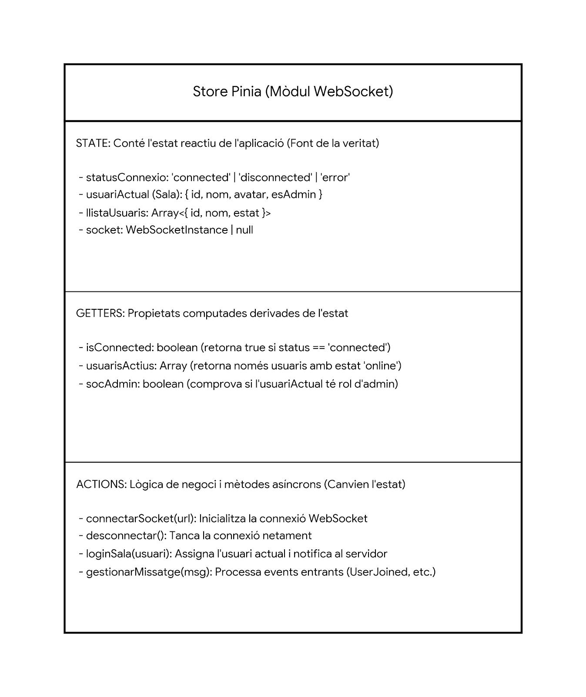

# Documentació del Projecte

Aquest document recull la informació tècnica i funcional del projecte. Aquí trobareu explicats els objectius, l'arquitectura, el disseny i les instruccions per al desenvolupament i desplegament.

> **Nota:** Les imatges es troben a la carpeta `esquemes/`.

---

## 1. Objectius

El propòsit principal d'aquesta aplicació és [Descriu aquí breument què fa l'app].

### Casos d'ús
A continuació es mostren les funcionalitats principals que ofereix el sistema als diferents tipus d'usuaris:


---

## 2. Arquitectura bàsica

L'arquitectura del sistema es basa en la interconnexió entre el client (Frontend), el servidor (Backend) i la base de dades.

### Esquema de Sistemes
Visió general de com es comuniquen els diferents mòduls:


### Tecnologies utilitzades
*   **Backend:** [NodeJS / Laravel / SpringBoot...]
*   **Frontend:** [Vue.js / React...]
*   **Base de Dades:** [MySQL / MongoDB...]
*   **Altres:** [Docker, Axios, etc.]

### Gestió d'Estat (Frontend)
Per a la gestió de l'estat global de l'aplicació s'utilitza **Pinia**. A continuació es detalla l'estructura dels *stores*:



---

## 3. Disseny i Flux d'Usuari

### Flux de l'Usuari (User Flow)
Aquest diagrama representa el camí que segueix l'usuari a través de l'aplicació per completar les tasques principals:


### Esquemes de Pantalla (Wireframes)
Esbossos de la disposició dels elements a les pantalles principals:

**Pantalla General:**


**Pantalla PI (Projecte Integrat / Pantalla Inicial):**


---

## 4. Entorn de desenvolupament

Passos per aixecar el projecte en local:

1.  Clonar el repositori:
    ```bash
    git clone https://github.com/inspedralbes/tr2-reptes-tr2-g4.git
    ```
2.  Instal·lar dependències del Backend:
    ```bash
    cd backend
    npm install
    # o composer install
    ```
3.  Instal·lar dependències del Frontend:
    ```bash
    cd frontend
    npm install
    ```
4.  Configurar variables d'entorn (`.env`).
   
5.  Executar (up) o tancar (down) el projecte.
    ```bash
    docker compose -f docker-compose.prod.yml up -d --build
    ```
    ```bash
    docker compose -f docker-compose.prod.yml up -d --build
    ```

---

## 5. Desplegament a producció

Explicació de com actualitzar i desplegar l'aplicació al servidor VPS.

### 5.1 Accés al servidor
Obre una terminal i connecta't via SSH:

```bash
ssh root@77.42.72.57
```

> **Nota:** En Windows, si l'anterior no funciona, prova amb la ruta completa:
> `C:\Windows\System32\OpenSSH\ssh.exe root@77.42.72.57`

Et demanarà la contrasenya d'accés al servidor.

### 5.2 Actualització del codi
Un cop dins del servidor, navega a la carpeta del projecte i descarrega els últims canvis de la branca `main`:

```bash
# Anar a la carpeta del projecte
cd /var/www/tr2-reptes-tr2-g4

# Comprovar carpetes (opcional)
ls

# Baixar canvis del repositori
git pull
```

### 5.3 Aixecar contenidors (Docker)
Entra a la carpeta específica de la integració (`Incorporacio_PI`), atura els contenidors antics i aixeca la nova versió:

```bash
cd Incorporacio_PI

# Aturar els contenidors actuals
docker compose -f docker-compose.prod.yml down

# Reconstruir i aixecar els contenidors en segon pla
docker compose -f docker-compose.prod.yml up -d --build
```

### 5.4 Configuració de Variables d'Entorn
Assegura't que els fitxers de configuració tenen les variables correctes.

**Exemple de fitxer `.env` (Backend):**
```properties
MONGODB_URI=mongodb+srv://dammongog4:<password>@clusterg4.dlau5vb.mongodb.net/Incorporacio_PI?appName=ClusterG4
EMAIL_USER=dammongog4@gmail.com
EMAIL_PASS=********
RECAPTCHA_SECRET_KEY=********
```

**Exemple de fitxer `.env.production` (Frontend):**
```properties
VITE_API_URL=http://incorporacio-pi.dam.inspedralbes.cat:3001
```

---

## 6. API Backend

Llistat d'endpoints disponibles.
=======
Llistat d'endpoints disponibles. 
>>>>>>> cf2e30a1246549b806208ca779b785b7ec56aa18

> _Opcional: Veure documentació Swagger a `/api/docs`_

### Exemple d'Endpoint: `GET /api/exemple`
*   **Descripció:** Retorna un llistat de...
*   **Exemple de petició:**
    ```json
    {
      "id": 1
    }
    ```
*   **Codis de resposta:**
    *   `200 OK`: Èxit.
    *   `404 Not Found`: No trobat.
*   **Exemple de resposta (JSON):**
    ```json
    {
      "status": "success",
      "data": []
    }
    ```

---

## 7. Aplicació Android / Altres elements

- Unity

---
