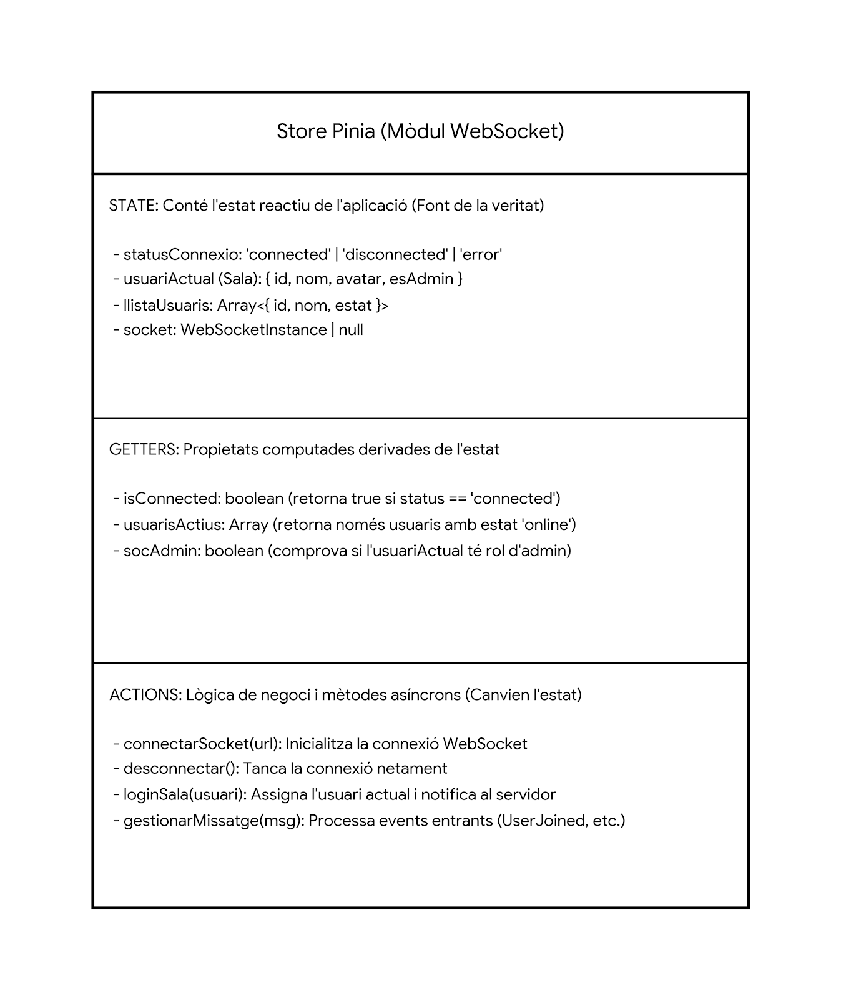

<div align="center">
  
  <h1>📚 Documentació Tècnica del Projecte</h1>
  <p>Aquest document recull la informació tècnica i funcional detallada per a desenvolupadors i administradors del sistema.</p>
</div>

---

## 📖 Taula de Continguts
1. [Objectius i Casos d'Ús](#1-objectius-i-casos-dús)
2. [Arquitectura del Sistema](#2-arquitectura-del-sistema)
3. [Disseny i Flux d'Usuari](#3-disseny-i-flux-dusuari)
4. [Entorn de Desenvolupament](#4-entorn-de-desenvolupament)
5. [Desplegament a Producció](#5-desplegament-a-producció)
6. [Referència de l'API](#6-referència-de-lapi)
7. [Context del Projecte](#7-context-del-projecte)

---

## 1. Objectius i Casos d'Ús

El propòsit principal d'aquesta aplicació és garantir la **continuïtat pedagògica** dels alumnes amb necessitats educatives especials durant el seu trànsit entre etapes educatives (ESO a FP).

### Casos d'ús
El sistema permet gestionar el cicle de vida de la documentació PI (Pla Individualitzat) amb el suport d'Intel·ligència Artificial.


---

## 2. Arquitectura del Sistema

L'arquitectura es basa en un model desacoblat on el Backend actua com a orquestrador entre el client, la base de dades i els serveis d'IA.

### Esquema de Sistemes
Visió general de la comunicació entre mòduls:


### Gestió d'Estat (Frontend)
S'utilitza **Pinia** per a una gestió reactiva i centralitzada de les dades de l'alumne i l'estat de la sessió.



---

## 3. Disseny i Flux d'Usuari

### Flux de l'Usuari (User Flow)
Representació del camí crític de l'usuari: des de la pujada del document fins a la recepció del resum generat per IA.


### Esquemes de Pantalla (Wireframes)
Esbossos de la interfície d'usuari (UI) dissenyats per a la màxima claredat per als docents.

**Pantalla de Gestió de Documents:**


---

## 4. Entorn de Desenvolupament

### Passos per aixecar el projecte en local:

1. **Clonar el repositori:**
   ```bash
   git clone https://github.com/inspedralbes/tr2-reptes-tr2-g4.git
   ```

2. **Backend:**
   ```bash
   cd Incorporacio_PI/backend
   npm install
   cp .env.example .env # Configura les teves claus
   npm run dev
   ```

3. **Frontend:**
   ```bash
   cd Incorporacio_PI/frontend
   npm install
   npm run dev
   ```

---

## 6. Referència de l'API

### Autenticació (`/api/login`)
- `POST /send-code`: Envia codi 2FA via email.
- `POST /verify-code`: Valida el codi i genera el token JWT.

### Alumnes (`/api/students`)
- `GET /`: Llista d'alumnes del centre actual.
- `POST /`: Registre de nou alumne.
- `PUT /:hash/transfer`: Inicia el procés de traspàs intercentre.

### Intel·ligència Artificial (`/api`)
- `POST /generate-summary`: Processament asíncron d'un document individual.
- `POST /generate-global-summary`: Agregació històrica de dades per a un informe evolutiu.

---

## 📂 7. Context del Projecte

Per a una visió més detallada de l'estructura i decisions del projecte, podeu consultar els següents fitxers:

- **[00_OBJECTIVE.md](Context/00_OBJECTIVE.md):** Missió i objectius.
- **[01_SCOPE.md](Context/01_SCOPE.md):** Abast i funcionalitats.
- **[02_ARCHITECTURE.md](Context/02_ARCHITECTURE.md):** Estructura tècnica i serveis.
- **[03_DECISIONS.md](Context/03_DECISIONS.md):** Registre de decisions (ADR).
- **[04_CONVENTIONS.md](Context/04_CONVENTIONS.md):** Convencions de codi.
- **[06_SYSTEM_MAP.md](Context/06_SYSTEM_MAP.md):** Mapa de fitxers i estructura.
- **[AI_WORKFLOW.md](Context/AI_WORKFLOW.md):** Flux detallat de la IA.

---

<div align="center">
  <sub>Documentació actualitzada el 29 d'abril de 2026</sub>
</div>
